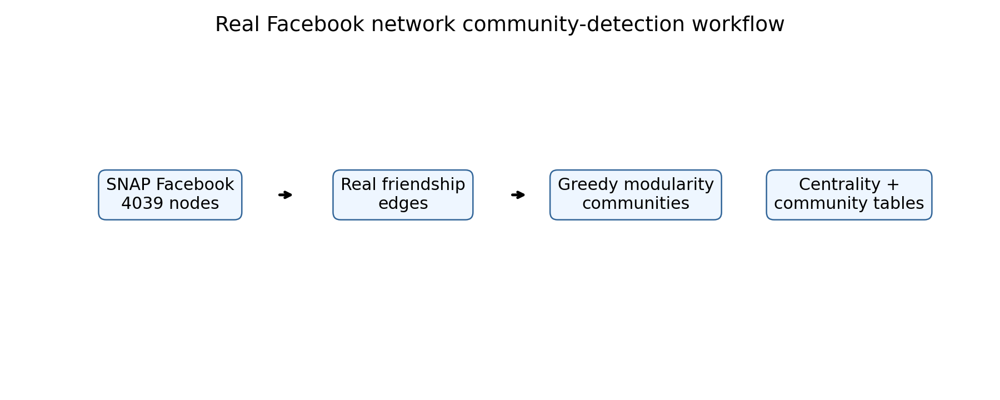
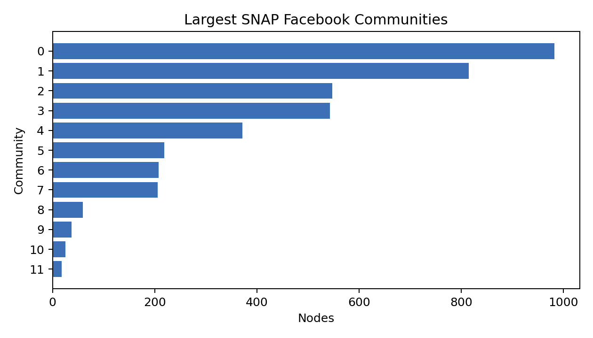
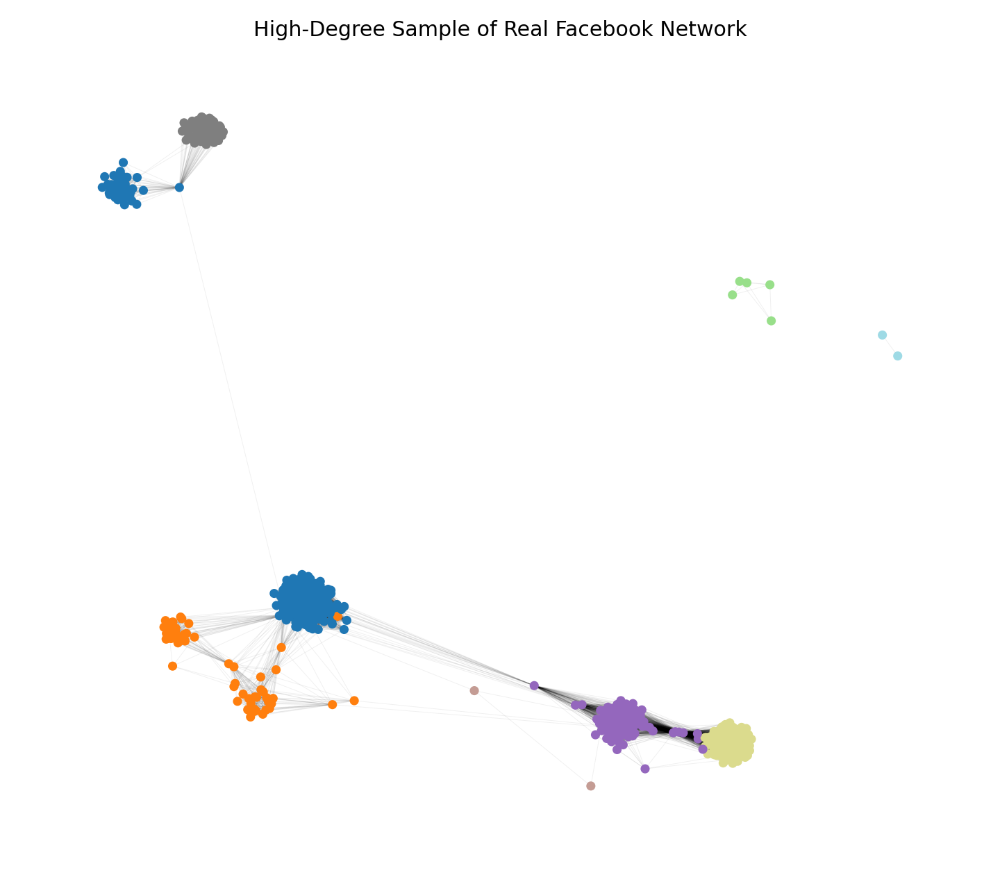

# Facebook Social Network Community Detection



Figure: the real SNAP Facebook network is loaded, communities are detected, and centrality/community tables are saved.

## Motivation

Community detection helps us understand how social networks organize into groups. The previous version used a planted synthetic graph. This version uses the real SNAP Facebook combined network, which makes the analysis more credible.

## Project Goal

We analyzed the real Facebook combined graph from SNAP and detected communities using greedy modularity optimization.

## Dataset

We used `facebook_combined.txt.gz` from the Stanford SNAP dataset collection.

- Nodes: 4,039
- Edges: 88,234
- Connected components: 1
- Density: 0.0108
- Average clustering: 0.6055

The raw dataset is downloaded into `data/`, which is ignored by Git.

## Tools

Python, NetworkX, pandas, and matplotlib.

## Method

We loaded the graph as an undirected social network. Then we calculated:

- Greedy modularity communities
- Modularity score
- Degree centrality
- Sampled betweenness centrality
- PageRank
- Community sizes and internal edges

## Results

| Metric | Value |
|---|---:|
| Nodes | 4,039 |
| Edges | 88,234 |
| Communities | 13 |
| Modularity | 0.7774 |
| Average clustering | 0.6055 |

Largest communities:

| Community | Size | Share of Nodes | Internal Edges |
|---:|---:|---:|---:|
| 0 | 983 | 0.2434 | 25,444 |
| 1 | 815 | 0.2018 | 13,453 |
| 2 | 548 | 0.1357 | 5,356 |
| 3 | 543 | 0.1344 | 13,755 |
| 4 | 372 | 0.0921 | 2,929 |





Result files:

- `results/graph_summary.csv`
- `results/community_summary.csv`
- `results/node_centrality.csv`

## Interpretation

The modularity score is high, which means the graph has strong community structure. This is expected in social networks: friend groups tend to be clustered around shared contexts such as schools, workplaces, or social circles.

The graph is also highly clustered. This means a user's friends are often connected to each other, which is another common property of social networks.

## Conclusion

This project now uses a real Facebook network instead of a synthetic planted graph. The main result is that the network has clear modular community structure, with 13 detected communities and modularity 0.7774.

## How To Run

```bash
pip install -r requirements.txt
python 1_real_facebook_snap_community_detection.py
```
